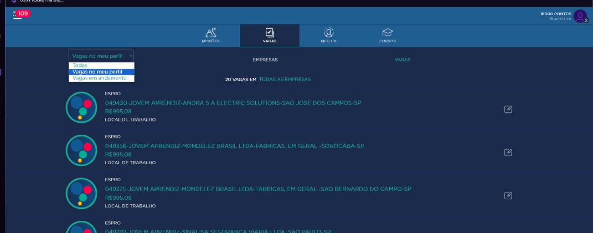
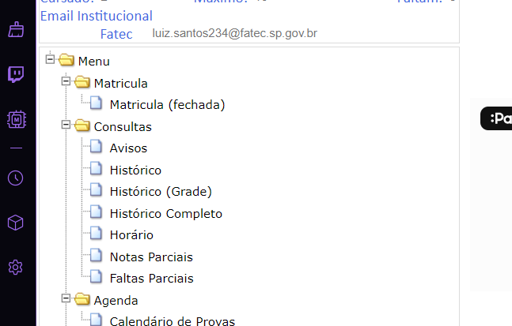
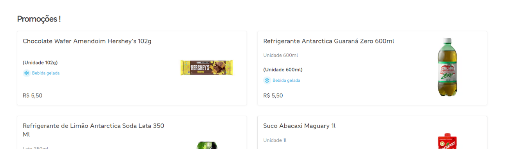
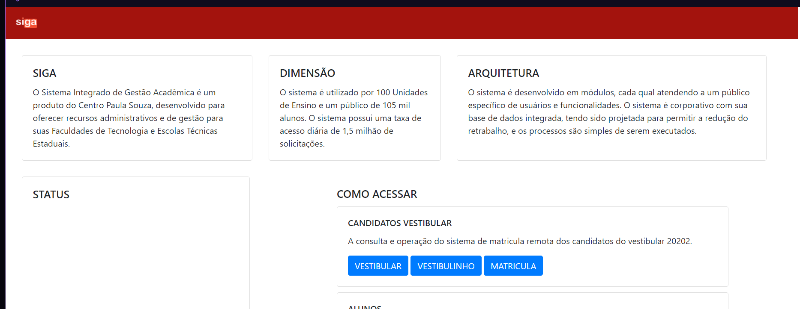
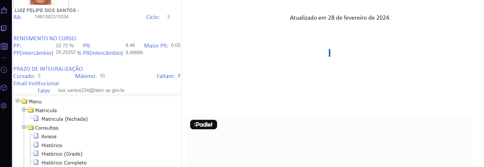
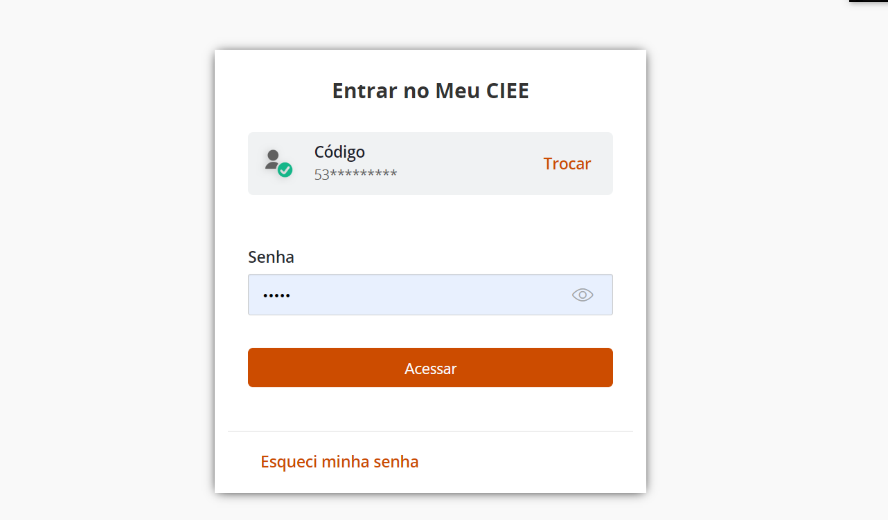
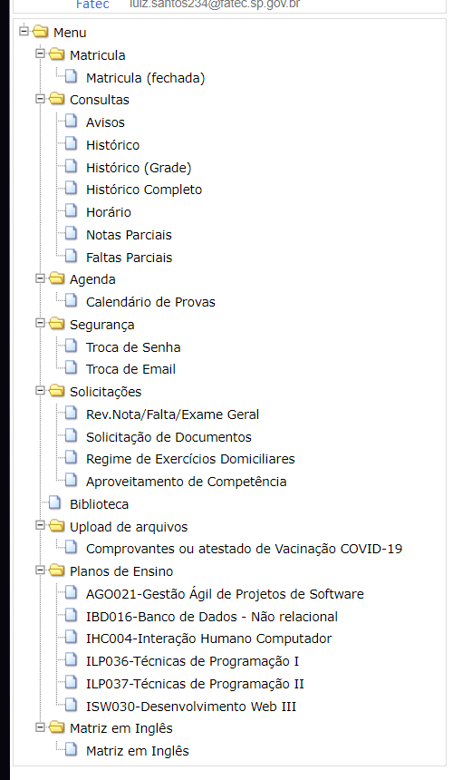
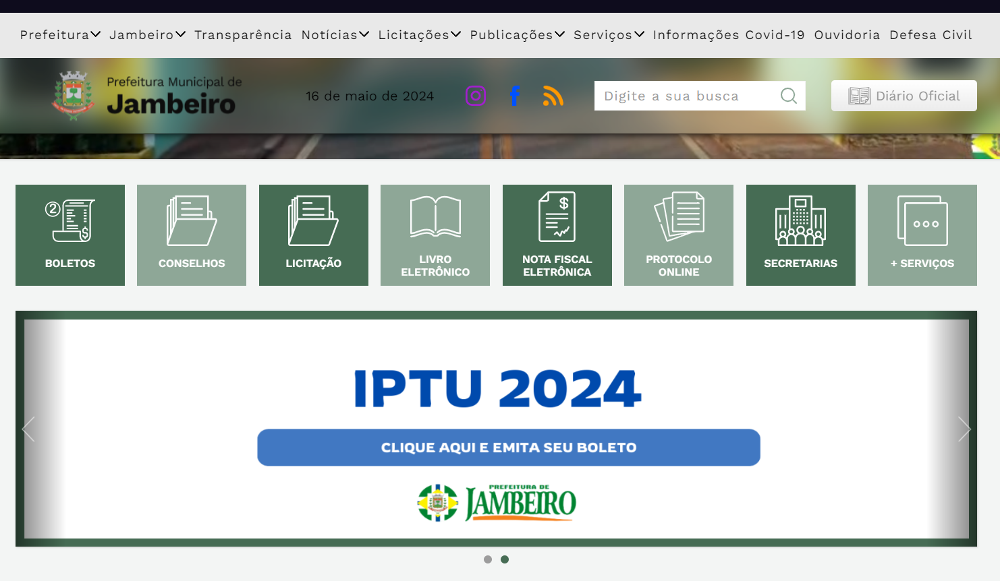
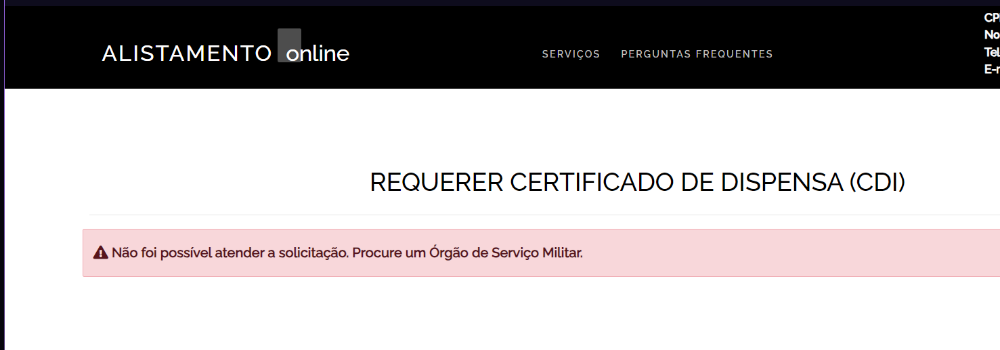

# As 10 heurísticas de usabilidade

## 1 - Visibilidade do status do sistema

A primeira heurística de usabilidade, "Visibilidade do status do sistema," enfatiza a importância de manter os usuários informados sobre o que está acontecendo no sistema em qualquer momento. Isso significa que o sistema deve fornecer feedback apropriado em tempo hábil, garantindo que os usuários saibam se suas ações foram bem-sucedidas, se estão em progresso ou se ocorreram erros.

Um exemplo do mal uso é o site do Expro:

Onde o filtro tem apenas as opções “Todas”, que se refere a todas as opções registradas no site, “Vagas no meu perfil” que se refere as vagas referente ao perfil do usuário e “Vagas em andamento”. Não há qualquer tipo de filtro por localidade, empresa ou status.

 

## 2 - Relação entre sistema e o mundo real

A segunda heurística de usabilidade, " Relação entre sistema e o mundo real" sugere que o sistema deve falar a linguagem dos usuários, com palavras, frases e conceitos familiares, em vez de terminologia técnica. As informações devem ser apresentadas em uma ordem lógica e natural, seguindo as convenções do mundo real, para que os usuários possam facilmente entender e interagir com o sistema. 

Um exemplo de mal uso é no Siga:

O site do SIGA carece de ícones que estabeleçam uma conexão com o usuário. As imagens dos ícones de arquivos são pouco informativas e não dizem nada ao usuário. Uma recomendação seria utilizar ícones com cores ou padrões que se relacionem entre si, como no caso dos históricos, ou então usar ícones que sejam diretamente relacionados ao assunto do link.

 

## 3 - Liberdade e controle do usuário

A terceira heurística de usabilidade, " Liberdade e controle do usuário" enfatiza a importância de oferecer aos usuários a capacidade de desfazer e refazer ações facilmente. Em muitos casos, os usuários selecionam funções por engano e precisam de uma "saída de emergência" claramente marcada para deixar o estado indesejado sem passar por um extenso diálogo. 

Um exemplo de mal uso é no Ifood:

No site do iFood, não é possível adicionar vários itens ao carrinho de forma rápida. Por exemplo, se eu quiser adicionar dois produtos, preciso colocar o primeiro no carrinho, depois voltar à loja e adicionar o segundo.

 

## 4 - Padrões e consistências

A quarta heurística de usabilidade, "Consistência e padrões," destaca a importância de manter uma uniformidade em termos de design, terminologia e comportamento em todo o sistema. Os usuários não devem se perguntar se diferentes palavras, situações ou ações significam a mesma coisa. 

Um exemplo de mal uso é Siga:

No site do SIGA, há diversos padrões inconsistentes. Na primeira imagem, é possível ver que o site utiliza o vermelho como cor de destaque, azul como cor auxiliar, e um fundo branco, com bordas arredondadas e um visual mais moderno. Já na segunda imagem, o site aparenta ser mais antigo, com um design quadrado e mal organizado. Não há utilização consistente das cores do site, apresentando apenas texto preto sobre fundo branco.

 

## 5 - Prevenção de erros

A quinta heurística de usabilidade, "Prevenção de erros," foca na importância de projetar sistemas que ajudem os usuários a evitar erros antes que eles ocorram. Isso pode ser feito através de um design intuitivo, mensagens de alerta e confirmação, e limitações que guiem o usuário para ações corretas.

Um exemplo de mal uso é o CIEE:

No site do CIEE, a senha deve conter apenas 5 números, o que impede o usuário de criar uma senha personalizada. Isso torna difícil para o usuário memorizar sua senha.

 

## 6 - Reconhecimento em vez de memorização

A sexta heurística de usabilidade, "Reconhecimento ao invés de memorização", destaca a importância de tornar as informações, opções e ações visíveis e disponíveis para os usuários, em vez de exigir que eles as memorizem. Isso significa que o sistema deve apresentar claramente as opções e funcionalidades, evitando a necessidade de os usuários lembrarem detalhes específicos ou comandos complexos. 

Um exemplo de mal uso é o Siga:

O site da Prefeitura de Jambeiro é bastante poluído de informações, principalmente na barra de navegação, o que dificulta a localização rápida dos destinos desejados pelos usuários.

 

## 7 - Flexibilidade e eficiência de uso

A sétima heurística de usabilidade, "Flexibilidade e eficiência de uso", enfatiza a importância de oferecer aos usuários diferentes formas de alcançar seus objetivos e de permitir que usuários experientes ou frequentes realizem suas tarefas de forma mais rápida e eficiente. Isso significa que o sistema deve fornecer atalhos, comandos abreviados e opções de personalização que permitam aos usuários escolher o caminho mais adequado para realizar uma tarefa. 

Por exemplo, um aplicativo de edição de texto pode oferecer atalhos de teclado para funções frequentemente utilizadas, como "Ctrl + S" para salvar, permitindo que usuários experientes realizem a tarefa sem a necessidade de utilizar o mouse. Essa flexibilidade não só aumenta a eficiência para usuários experientes, mas também melhora a usabilidade para usuários iniciantes, oferecendo opções para se adaptar às preferências individuais e níveis de habilidade.

 

## 8 - Estética de design minimalista

A oitava heurística de usabilidade, "Estética e design minimalista", destaca a importância de manter um design limpo e visualmente agradável, evitando sobrecarregar os usuários com informações desnecessárias ou elementos visuais excessivos. Um design minimalista reduz a carga cognitiva sobre os usuários, tornando mais fácil para eles entenderem e navegarem pelo sistema. Isso inclui a utilização adequada de espaço em branco, hierarquia visual clara, cores e fontes legíveis, e elementos visuais que direcionam a atenção para as informações mais importantes.

Um exemplo de mal uso é o site da prefeitura municipal de Jambeiro:

O site da Prefeitura de Jambeiro é bastante poluído de informações, principalmente na barra de navegação, o que dificulta a localização rápida dos destinos desejados pelos usuários.

 

## 9 - Ajudar o usuário a reconhecer, diagnosticar e recuperar-se de erros

A nona heurística de usabilidade, "Ajude os usuários a reconhecerem, diagnosticarem e recuperarem-se de erros", destaca a importância de fornecer feedback claro e orientações úteis aos usuários quando ocorrem erros durante a interação com o sistema. Isso inclui mensagens de erro descritivas que explicam o problema de forma compreensível e oferecem sugestões ou instruções sobre como corrigi-lo. Além disso, o sistema deve permitir que os usuários desfaçam ações indesejadas facilmente e recuperem-se de erros sem perder dados importantes.

Um exemplo de mal uso é o site do exército:

No site do Exército, não é possível identificar qual foi o erro ao solicitar um certificado, deixando o usuário perdido.

 

# 10 - Ajuda e documentação

A décima heurística de usabilidade, "Ajude e documentação", destaca a importância de fornecer suporte útil e documentação adequada para os usuários. Isso inclui manuais de usuário, tutoriais, FAQs (Perguntas frequentes) e outros recursos que ajudem os usuários a compreenderem como usar o sistema de forma eficaz e resolverem problemas que possam surgir. Além disso, o sistema deve oferecer ajuda contextual, como dicas de ferramentas e mensagens de orientação, para orientar os usuários durante a interação.

No site do SIGA, é evidente o mal uso da décima heurística de usabilidade. Os usuários não têm acesso a uma aba de ajuda ou a uma seção de perguntas frequentes (FAQ) que poderiam fornecer suporte útil e informações adicionais sobre o funcionamento do sistema.
